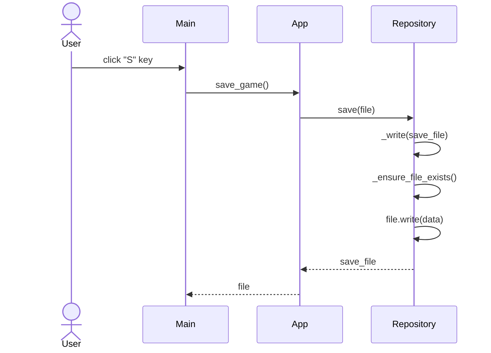

# Arkkitehtuurikuvaus

## Pakkauskaavio
:(

## Sekvenssikaavio pelisilmukasta

Kaavion avulla on havainnollisestettuna, mitä yhden pelisilmukan iteraation aikana tapahtuu

```mermaid
sequenceDiagram
    actor Main
    participant GameLoop
    participant EventHandler

    Main->>GameLoop: start()
    create participant pygame.time.Clock
    GameLoop->>pygame.time.Clock: create Clock
    create participant App
    GameLoop->>App: create App
    create participant Repository
    App->>Repository: create Repository
    create participant AppUI: create AppUI
    GameLoop->>AppUI: create AppUI
    create participant pygame.window
    AppUI->>pygame.window: create pygame.window
    create participant Golden
    GameLoop->>Golden: create Golden
    create participant EventHandler
    GameLoop->>EventHandler: create EventHandler

    GameLoop->>App: load_game()
    App->>Repository: load()
    Repository->>Repository: _read()
    Repository-->>App: loaded_file
    App->>App: _calculate_profit()

    GameLoop->>GameLoop: sync()
    GameLoop->>EventHandler: handle_events()

    GameLoop->>AppUI: fill_screen()
    AppUI->>pygame.window: fill(grey)

    GameLoop->>AppUI: render_text()
    AppUI->>pygame.window: blit(counter)
    AppUI->>pygame.window: blit(score_per_second)

    GameLoop->>AppUI: render_elements()
    
    
    

```

## Sekvenssikaavio pelin tallentamisesta
Sekvenssikaavio havainnollistaa, miten eri funktiokutsut etenevät käyttäjän tallentaessa pelin.


