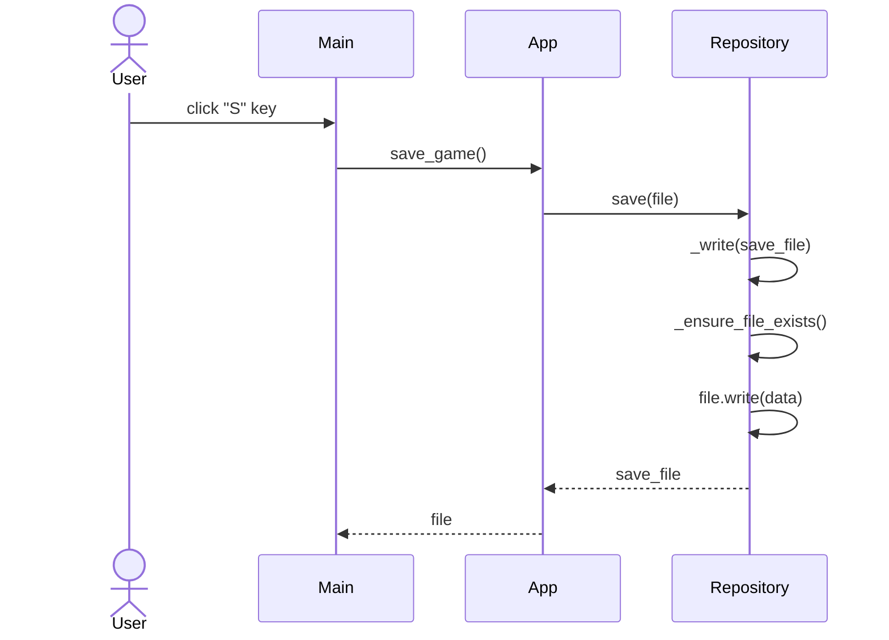

# Arkkitehtuurikuvaus

## Pakkauskaavio

## Sekvenssikaavio
Sekvenssikaavio havainnollistaa, miten eri funktiokutsut etenevät käyttäjän tallentaessa pelin.

```mermaid
sequenceDiagram
    actor User
    participant Main
    participant App
    participant Repository
    User->>Main: click "S" key
    Main->>App: save_game()
    App->>Repository: save(file)
    Repository->>Repository: _write(save_file)
    Repository->>Repository: _ensure_file_exists()
    Repository->>Repository: file.write(data)
    Repository-->>App: save_file
    App-->>Main: file
```
