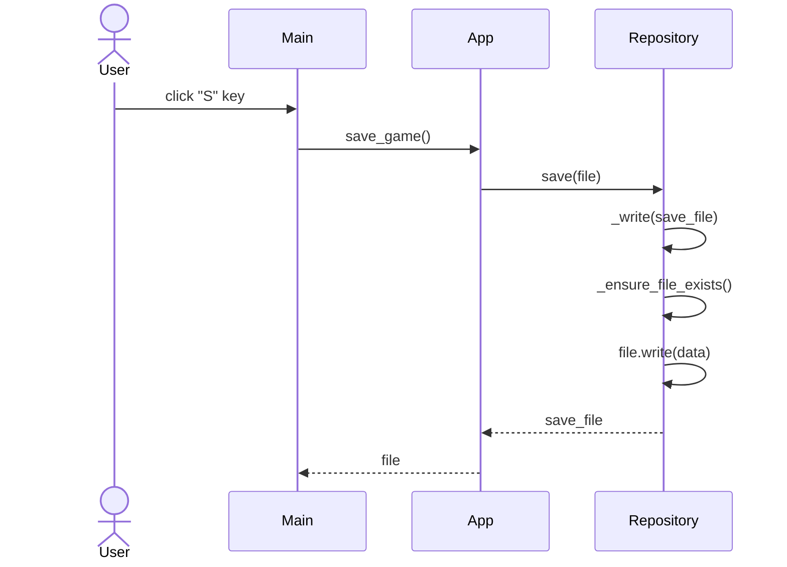

# Arkkitehtuurikuvaus

## Pakkauskaavio
:(

## Sekvenssikaavio pelisilmukasta

Kaavio on pitkä, mutta siinä on havainnollistettuna pelisilmukan toiminto yhden silmukan iteraation aikana. Pelisilmukassa on if-lauseita riippuen siitä, mitä syötteitä käyttäjä antaa, joten en ole merkinnyt kaikkea mitä voisi mahdollisesti tapahtua samanaikaisesti tähän kaavioon.

## Sekvenssikaavio pelin tallentamisesta
Sekvenssikaavio havainnollistaa, miten eri funktiokutsut etenevät käyttäjän tallentaessa pelin.

