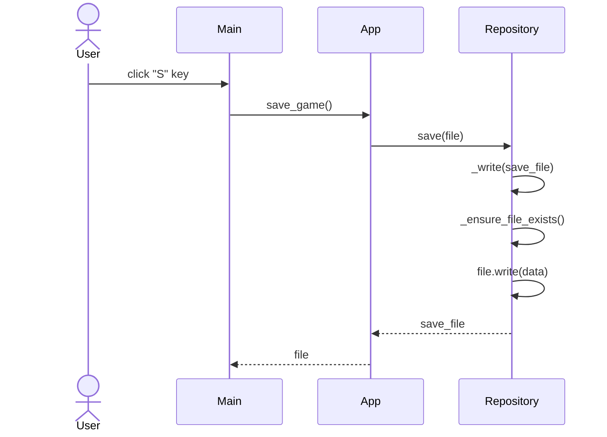

# Arkkitehtuurikuvaus

## Koodin rakenne

Koodi rakentuu eri moduuleista ja luokista, jotka kukin käsittelevät omaa tehtäväänsä. Tärkeimpänä näistä on game_loop, joka päivittää peliä 60 kertaa sekunnissa, ja lähettää kunkin käyttäjän syötteen kohdalla tiedot UI-luokalle siitä, mitä näytöllä tulee näkyä syötteen perusteella ja esim. App-luokalle siitä, mitä päivityksiä pelaaja juuri osti. Nämä luokat kutsuvat yhä uusia apuluokkia tapahtumien käsittelyssä, kuten App kutsuu Particle-luokkaa, kun näytölle pitää piirtää kahvikupista putoava partikkeli.

## Sekvenssikaavio pelisilmukasta

Kaavio on pitkä, mutta siinä on havainnollistettuna pelisilmukan toiminto yhden silmukan iteraation aikana. Pelisilmukassa on if-lauseita riippuen siitä, mitä syötteitä käyttäjä antaa, joten en ole merkinnyt kaikkea mitä voisi mahdollisesti tapahtua samanaikaisesti tähän kaavioon. Kaavio on toteutettu mermaid live-editorilla, sillä github ei tue 'create participant' -komentoa, jota kaaviossa käytetään.

Tämä kaaviosta puuttuu, mutta pelisilmukassa tarkistetaan myös, tarvitseeko AppUI-oliolle lähettää kutsua tietyn elementin renderauksesta ajastimien (timers) perusteella. Esimerkiksi jos pelisilmukka generoi tietyllä hetkellä kultaisen kahvin ruudulle, se kasvattaa tämän ajastinta seitsemällä sekunnilla. Näin UI-luokka tietää, kuinka monta framea tätä kultaista kahvia täytyy renderoida näytölle. Tämä samaa periaatetta hyödynnetään pelisilmukassa muidenkin ajastetuiden elementtien kohdalla, kuten "Game saved" -ilmoituksessa käyttäjän painaessa S-näppäintä.

Otin kaaviosta myös selkeyden vuoksi pois yksityiskohdat siitä, mitä tapahtuu tapahtumankäsittelijäluokassa.

## Sekvenssikaavio pelin tallentamisesta
Sekvenssikaavio havainnollistaa, miten eri funktiokutsut etenevät käyttäjän tallentaessa pelin.

