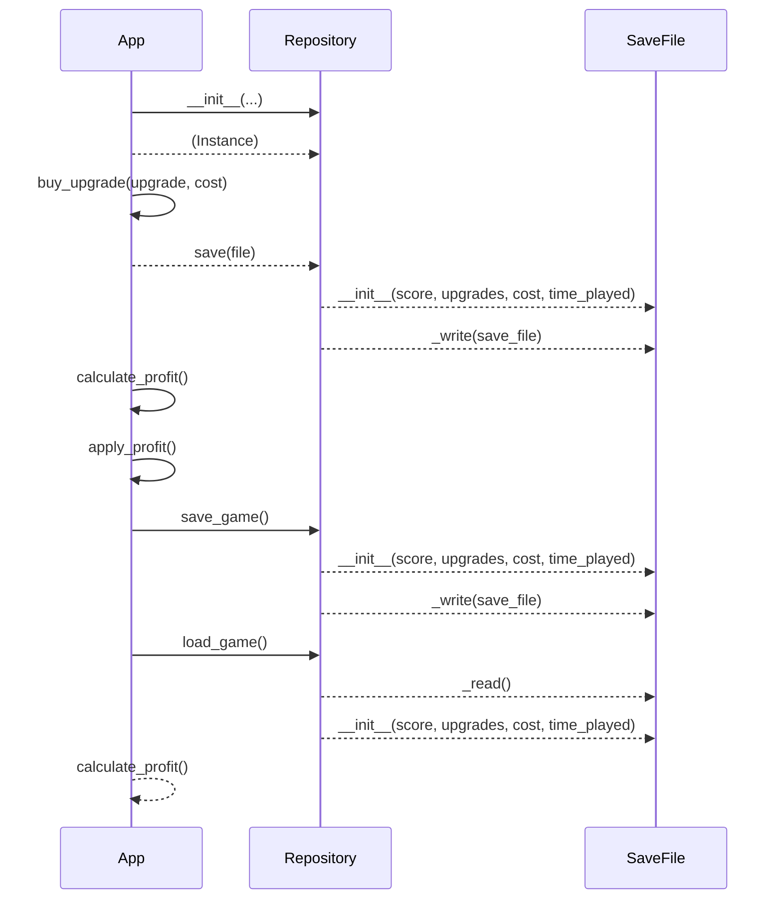

# Arkkitehtuurikuvaus

## Pakkauskaavio

## Sekvenssikaavio App-luokan toiminnallisuudesta

```mermaid
sequenceDiagram
    participant App
    participant Repository
    participant SaveFile

    App ->> Repository: __init__(...)
    App -->> Repository: (Instance)
    
    App ->> App: buy_upgrade(upgrade, cost)
    App -->> Repository: save(file)
    Repository -->> SaveFile: __init__(score, upgrades, cost, time_played)
    Repository -->> SaveFile: _write(save_file)
    
    App ->> App: calculate_profit()
    App ->> App: apply_profit()
    
    App ->> Repository: save_game()
    Repository -->> SaveFile: __init__(score, upgrades, cost, time_played)
    Repository -->> SaveFile: _write(save_file)
    
    App ->> Repository: load_game()
    Repository -->> SaveFile: _read()
    Repository -->> SaveFile: __init__(score, upgrades, cost, time_played)
    App -->> App: calculate_profit()
```
