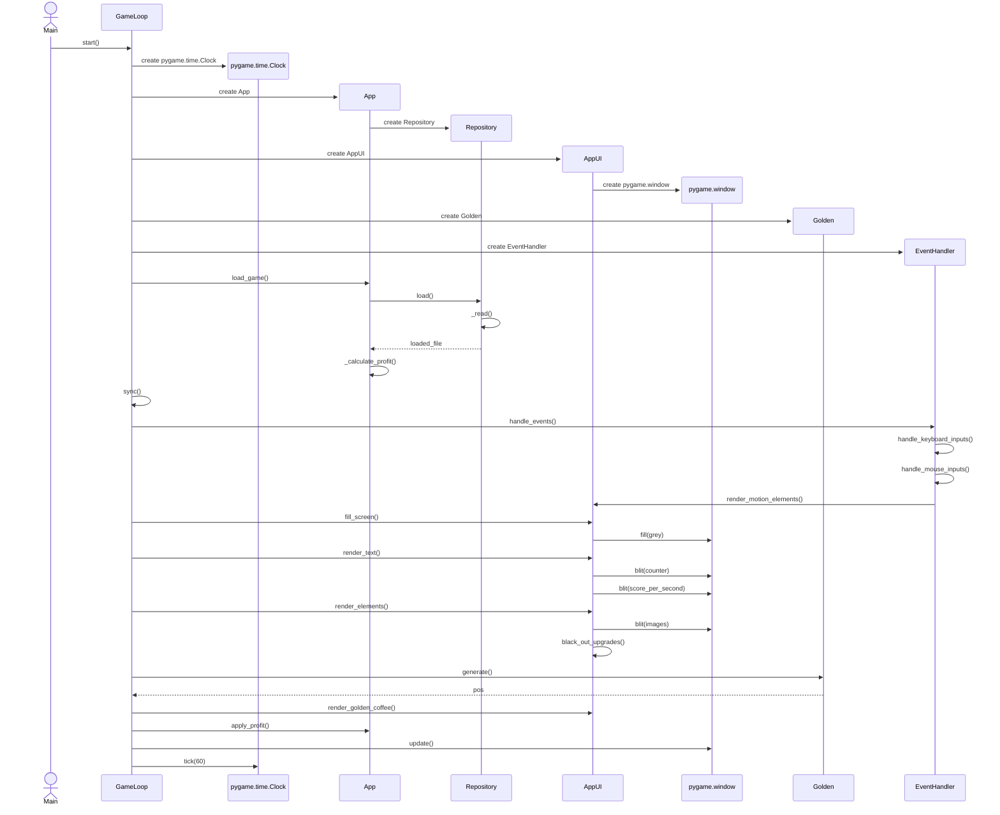

# Arkkitehtuurikuvaus

## Pakkauskaavio
:(

## Sekvenssikaavio pelisilmukasta

Kaavion avulla on havainnollisestettuna, mitä yhden pelisilmukan iteraation aikana tapahtuu

## Sekvenssikaavio pelin tallentamisesta
Sekvenssikaavio havainnollistaa, miten eri funktiokutsut etenevät käyttäjän tallentaessa pelin.

