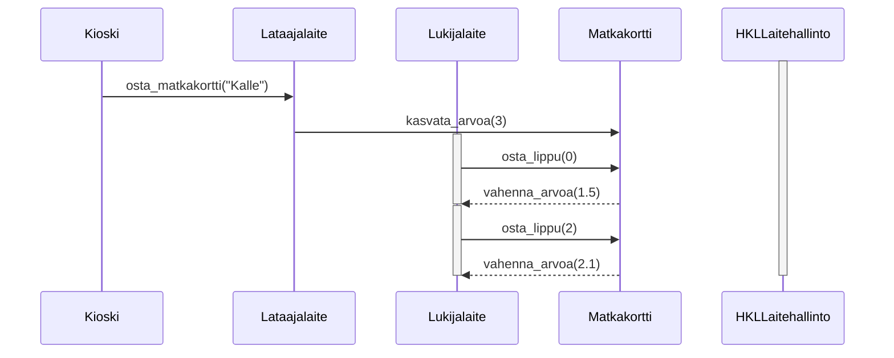

## HSL maksukorttiluokan sekvenssikaavio

```mermaid
sequenceDiagram
    participant Kioski
    participant Lataajalaite
    participant Lukijalaite
    participant Matkakortti
    participant HKLLaitehallinto

    activate HKLLaitehallinto

    Kioski ->> Lataajalaite: osta_matkakortti("Kalle")
    Lataajalaite ->> Matkakortti: kasvata_arvoa(3)

    activate Lukijalaite
    Lukijalaite ->> Matkakortti: osta_lippu(0)
    Matkakortti -->> Lukijalaite: vahenna_arvoa(1.5)
    deactivate Lukijalaite

    activate Lukijalaite
    Lukijalaite ->> Matkakortti: osta_lippu(2)
    Matkakortti -->> Lukijalaite: vahenna_arvoa(2.1)
    deactivate Lukijalaite

    deactivate HKLLaitehallinto
```
