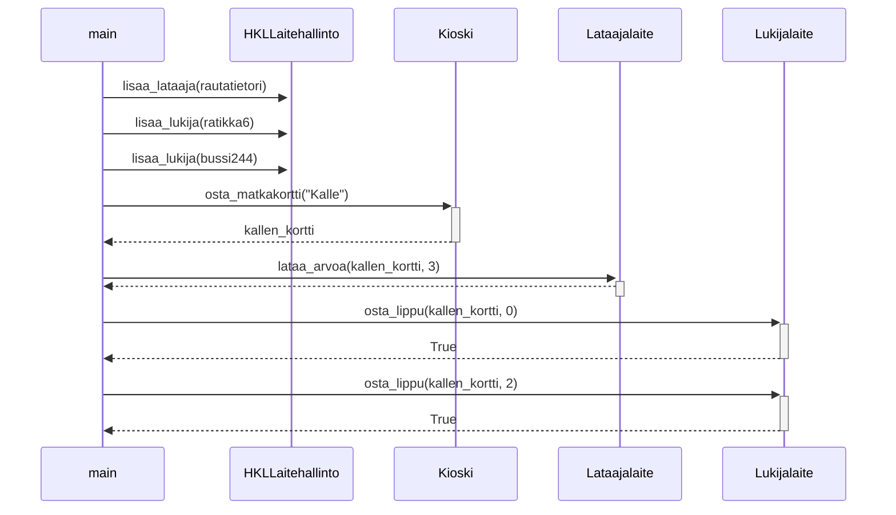

```mermaid
 sequenceDiagram
    participant main

    main->>+HKLLaitehallinto: lisaa_lataaja(rautatietori)
    main->>+HKLLaitehallinto: lisaa_lukija(ratikka6)
    main->>+HKLLaitehallinto: lisaa_lukija(bussi244)
    main->>+Kioski: osta_matkakortti("Kalle")
    Kioski-->>-main: kallen_kortti
    main->>+Lataajalaite: lataa_arvoa(kallen_kortti, 3)
    Lataajalaite-->>-main: 
    main->>+Lukijalaite: osta_lippu(kallen_kortti, 0)
    Lukijalaite-->>-main: True
    main->>+Lukijalaite: osta_lippu(kallen_kortti, 2)
    Lukijalaite-->>-main: True
```
