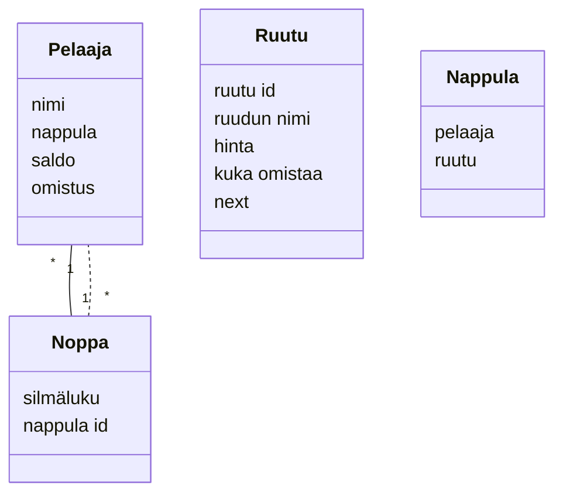

Monopoli havainnollistettuna luokkakaaviona:

```mermaid
 classDiagram
      Pelaaja "*" -- "1" Noppa
      
      class Ruutu{
          ruutu id
          ruudun nimi
          hinta
          kuka omistaa
          next
      }
      class Pelaaja{
          nimi
          nappula
          saldo
          omistus
      }    
      
      Noppa "*" ..  "1" Pelaaja
      class Noppa{
          silmäluku
          nappula id
      }
      
      class Nappula{
          pelaaja
          ruutu
      }
      
```
