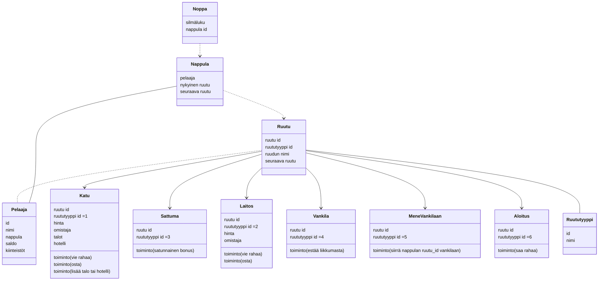

Monopoli havainnollistettuna luokkakaaviona:

```mermaid
 classDiagram
      Noppa ..> Nappula
      Pelaaja -- Nappula
      Nappula ..> Ruutu
      Ruutu .. Pelaaja
      Ruutu --> Katu
      Ruutu --> Sattuma
      Ruutu --> Laitos
      Ruutu --> Vankila
      Ruutu --> MeneVankilaan
      Ruutu --> Aloitus
      Ruutu -- Ruututyyppi
      
      class Ruutu{
          ruutu id
          ruututyyppi id
          ruudun nimi
          seuraava ruutu
      }
      
      class Pelaaja{
          id
          nimi
          nappula
          saldo
          kiinteistöt
      }    
      
      class Noppa{
          silmäluku
          nappula id
      }
      
      class Nappula{
          pelaaja
          nykyinen ruutu
          seuraava ruutu
      }
      
      class Ruututyyppi{
          id
          nimi
      }
      
      class Katu{
          ruutu id
          ruututyyppi id =1
          hinta
          omistaja
          talot
          hotelli
          toiminto (vie rahaa)
          toiminto (osta)
          toiminto (lisää talo tai hotelli)
      }
      
      class Laitos{
          ruutu id
          ruututyyppi id =2
          hinta 
          omistaja
          toiminto (vie rahaa)
          toiminto (osta)
      }
          
      class Sattuma{
          ruutu id
          ruututyyppi id =3
          toiminto (satunnainen bonus)
      }
          
      class Vankila{
          ruutu id
          ruututyyppi id =4
          toiminto (estää liikkumasta)
      }
      
      class MeneVankilaan{
          ruutu id
          ruututyyppi id =5
          toiminto (siirrä nappulan ruutu_id vankilaan)
      }
      
      class Aloitus{
          ruutu id 
          ruututyyppi id =6
          toiminto (saa rahaa)
      }
          
```
