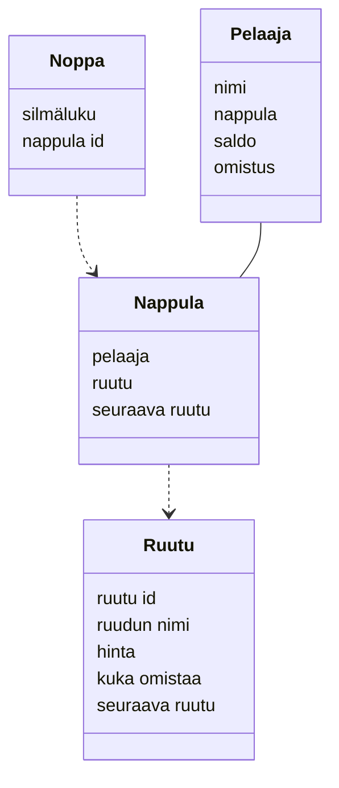

Monopoli havainnollistettuna luokkakaaviona:

```mermaid
 classDiagram
      Noppa ..> Nappula
      Pelaaja -- Nappula
      Nappula ..> Ruutu
      
      class Ruutu{
          ruutu id
          ruudun nimi
          hinta
          kuka omistaa
          seuraava ruutu
      }
      class Pelaaja{
          nimi
          nappula
          saldo
          omistus
      }    
      
      class Noppa{
          silmäluku
          nappula id
      }
      
      class Nappula{
          pelaaja
          ruutu
          seuraava ruutu
      }
      
```
