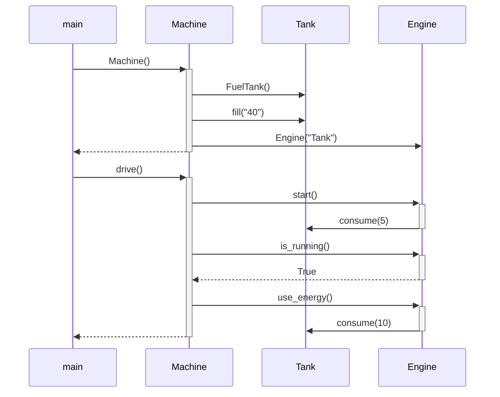

```mermaid
    sequenceDiagram
        participant main
   
        main->>+Machine: Machine()
       
        Machine->>Tank: FuelTank()
        Machine->>Tank: fill("40")
        Machine->>Engine: Engine("Tank")
    
        Machine-->>-main: 
        
        
        main->>+Machine: drive()
        
        Machine->>+Engine: start()
        
        Engine->>-Tank: consume(5)
        
        
        Machine->>+Engine: is_running()
        
        Engine-->>-Machine: True
        
        
        Machine->>+Engine: use_energy()
        
        Engine->>-Tank: consume(10)
        
        Machine-->>-main: 
        
        
```
