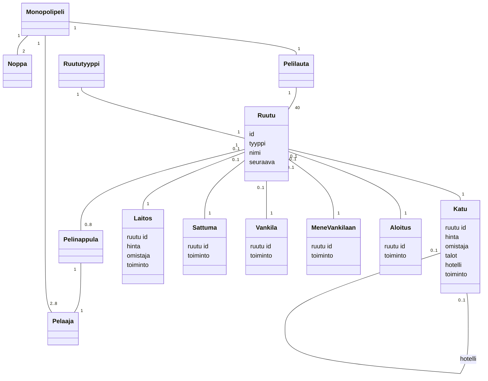

## Monopoli, alustava luokkakaavio

```mermaid
 classDiagram
    Monopolipeli "1" -- "2" Noppa
    Monopolipeli "1" -- "1" Pelilauta
    Pelilauta "1" -- "40" Ruutu
    Ruututyyppi "1" -- "1" Ruutu
    Katu "0..4" -- "0..4" Katu : talot
    Katu "0..1" -- "0..1" Katu : hotelli
    Ruutu "1" -- "0..8" Pelinappula
    Pelinappula "1" -- "1" Pelaaja
    Pelaaja "2..8" -- "1" Monopolipeli
    Ruutu "0..1" -- "1" Katu
    Ruutu "0..1" -- "1" Laitos
    Ruutu "0..1" -- "1" Sattuma
    Ruutu "0..1" -- "1" Vankila
    Ruutu "0..1" -- "1" MeneVankilaan
    Ruutu "0..1" -- "1" Aloitus

    class Ruutu{
	id
	tyyppi
	nimi
	seuraava
    }


    class Katu{
	ruutu id
	hinta
	omistaja
	talot
	hotelli
	toiminto
    }

    class Laitos{
	ruutu id
	hinta
	omistaja
	toiminto
    }

    class Sattuma{
	ruutu id
	toiminto
    }

    class Vankila{
	ruutu id
	toiminto
    }

    class MeneVankilaan{
	ruutu id
	toiminto
    }

    class Aloitus{
	ruutu id
	toiminto
    }
```
